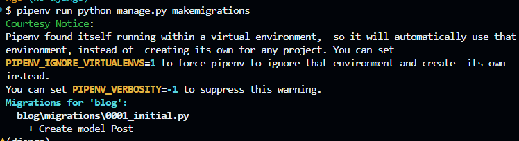
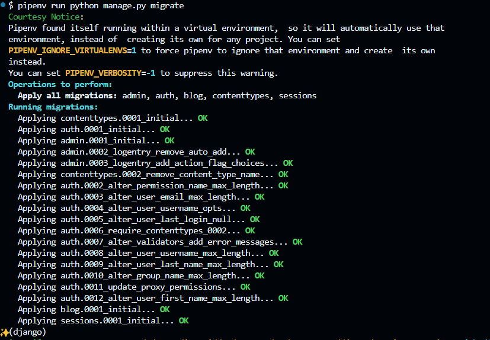

# Django

framework de angular

mapeador ORM para el manejo de base de datos, autogenera un swagger. 

## para que no usarlo

Manejar microservicios sin backend
aplicaciones de big data
plataformas con sockets en tiempo real.  

## instalacion

```bash
pipenv install django
```

## Crear proyecto

```bash
pipenv run django-admin startproject gettingStartDjango
```

## Notas

el [PipFile](Pipfile) es como el package.json de npm donde puedo poner script para ahorrarme el aprenderme comandos

por ejemplo el siguiente comando `pipenv run python manage.py runserver` se puede reducir a un `pipenv run server` editanto del pipfile de la siguiente forma

```pipfile
[scripts]
server = "python manage.py runserver"
```
## Configuraciones basicas

en [settings.py](gettingStartDjango/gettingStartDjango/settings.py) existe esto

```python
# TODO: SECURITY WARNING: don't run with debug turned on in production!
DEBUG = False

ALLOWED_HOSTS = ["127.0.0.1"]
```
Ese debug debe estar en False para entornos productivos y se deben colocar las rutas a las cuales puedo acceder a mi servicio. 
por ejemplo si no pongo el `127.0.0.1` no puedo acceder a mi servicio. `CommandError: You must set settings.ALLOWED_HOSTS if DEBUG is False.`

## Crear apps

### al nivel de manage.py

db.sqlite3  gettingStartDjango/  manage.py*

se crea el app 
```bash
pipenv run python manage.py startapp blog
```

## Modelos
[models](gettingStartDjango/blog/models.py)


Para sincronizar con los modelos creados

```sh
$ pipenv run python manage.py makemigrations
```



para aplicarla

```sh
pipenv run python manage.py migrate
```



a estos elementos se le pueden especificar el modelo a migrar y sincronizar añadiendo al final el modelo / tabla
