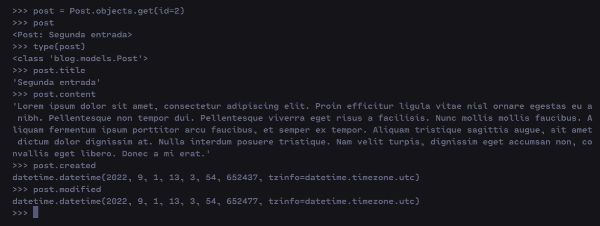

# Django

framework de angular

mapeador ORM para el manejo de base de datos, autogenera un swagger. 

## para que no usarlo

Manejar microservicios sin backend
aplicaciones de big data
plataformas con sockets en tiempo real.  

## instalacion

```bash
pipenv install django
```

## Crear proyecto

```bash
pipenv run django-admin startproject gettingStartDjango
```

## Notas

el [PipFile](Pipfile) es como el package.json de npm donde puedo poner script para ahorrarme el tecle tecle de comandos

por ejemplo el siguiente comando `pipenv run python manage.py runserver`, el cual es para iniciar el servidor, se puede reducir a un `pipenv run server` editanto del pipfile de la siguiente forma

```pipfile
[scripts]
server = "python manage.py runserver"
```
## Configuraciones basicas

en [settings.py](gettingStartDjango/gettingStartDjango/settings.py) existe esto

```python
# TODO: SECURITY WARNING: don't run with debug turned on in production!
DEBUG = False

ALLOWED_HOSTS = ["127.0.0.1"]
```

Ese debug debe estar en False para entornos productivos y se deben colocar las rutas a las cuales puedo acceder a mi servicio. 
por ejemplo si no pongo el `127.0.0.1` no puedo acceder a mi servicio. `CommandError: You must set settings.ALLOWED_HOSTS if DEBUG is False.`

## Crear apps

### al nivel de manage.py

db.sqlite3  gettingStartDjango/  manage.py*

se crea el app 

```bash
pipenv run python manage.py startapp blog
```

## Modelos
[models](gettingStartDjango/blog/models.py)


Para sincronizar con los modelos creados

```sh
$ pipenv run python manage.py makemigrations
```


para aplicarla

```sh
pipenv run python manage.py migrate
```


a estos elementos se le pueden especificar el modelo a migrar y sincronizar añadiendo al final el modelo / tabla

## Administrador
https://docs.djangoproject.com/en/5.2/ref/contrib/admin/

Comando para crear un super usuario

```sh
pipenv run python manage.py createsuperuser
```

Dashboard: http://127.0.0.1:8000/admin/

### Shell

Entrar a ella

```sh
pipenv run python manage.py shell
```

Obtener todos los registros `Post.objects.all()`
Obtener el primero `Post.objects.first()`
Ultimo: `Post.objects.last()`
Por indice `Post.objects.get(id={No.})`

Se pueden asignar a variables y luego usarlas



## URLS y Vistas

La vista o pagina se mapea en [gettingStartDjango/urls.py](/gettingStartDjango/urls.py) la cual apunta en este caso a [blog/view.py](/blog/views.py)

Ejemplo
```py
from blog.views import home #Importas la vista

urlpatterns = [
    path('', home), #Defines la url y la funcion que contiene la vista. en este caso estara en la raiz y la funcion seria home
]
```

en la vista [view.py](/blog/views.py) es donde colocarias la plantilla html o lo que quieres devolver a lo antes definido en el view.py

Ejemplo
```py
def home(request):
    return render(request, 'home.html')
```

## Template Filters como los pipes de angular

https://www.geeksforgeeks.org/python/django-template-filters/

https://docs.djangoproject.com/en/5.2/ref/templates/builtins/#built-in-filter-reference


Uso
```py
{{post.content | truncatewords:10}}

```